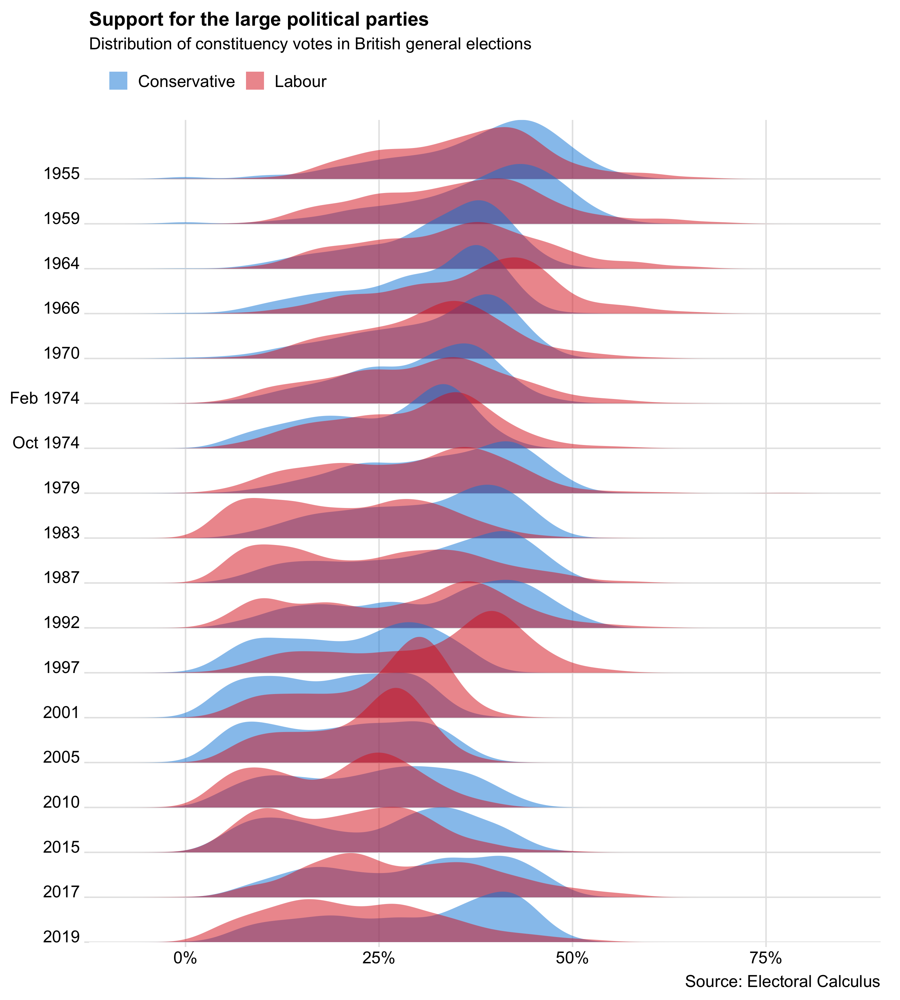

An R script to download British parlimentary elections data for elections
between 1955 and 2019, and plot the distribution of the vote share for the
Conservative and Labour parties as a ridgeline plot. You can read more about it in a blog post, [The rise and fall in support for British political parties].

The data is from [Election Calculus]. The chart is created using Hadley Wickham’s [`ggplot2`] package and Claus Wilke’s [`ggridges`] extension.

  [The rise and fall in support for British political parties]: https://www.flother.is/blog/british-party-support/
  [Election Calculus]: http://www.electoralcalculus.co.uk/flatfile.html
  [`ggplot2`]: https://ggplot2.tidyverse.org/
  [`ggridges`]: https://github.com/clauswilke/ggridges
